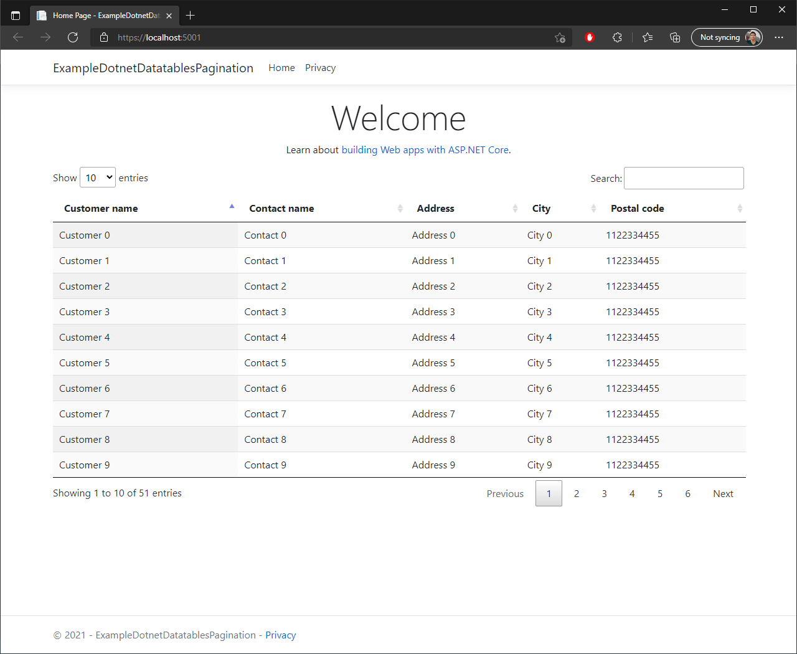

## What is this projetct

It is a small/simple example that implements Datatables "server side", in this example, shows how to call a store procedure into SqlServer(T-SQL) and return the data to frontend be to renderized by datatables using self metadata and options.

## Back-end

.Net Core 5.0 Web Mvc/Api

## Front-end

- Html
- Razor

## Libraries used
### Front
- JQuery
- Datatables

### Backend
- Dapper

## Database objects
### Table
```
DROP TABLE Customer
GO
CREATE TABLE [dbo].[Customer](
	[CustomerID] [int] IDENTITY(1,1) NOT NULL,
	[CustomerName] [varchar](50) NULL,
	[ContactName] [varchar](50) NULL,
	[Address] [varchar](50) NULL,
	[City] [varchar](50) NULL,
	[PostalCode] [varchar](10) NULL,
	[Country] [varchar](50) NULL
) ON [PRIMARY]
GO
```

### Mass data
```
TRUNCATE TABLE Customer
DECLARE @customer INT = 0

WHILE @customer <= 50
BEGIN
    DECLARE @customerStr VARCHAR(MAX) = CAST(@customer AS VARCHAR)

	INSERT INTO Customer VALUES ('Customer ' + @customerStr, 'Contact ' + @customerStr, 'Address ' + @customerStr, 'City ' + @customerStr, '1122334455', 'Country ' + @customerStr)

	SET @customer += 1
END
```

## Procedure
```
DROP PROCEDURE stpGetCustomers
GO
CREATE PROCEDURE stpGetCustomers (	@sortColumn INT,
									@sortOrder VARCHAR(50),
									@offsetValue INT,
									@pagingSize INT,
									@searchText VARCHAR(50))
AS
BEGIN
    SELECT
		CustomerID,
		CustomerName,
		ContactName,
		Address,
		City,
		PostalCode,
		Country,
		count(CustomerID) OVER () AS FilterTotalCount 
	FROM
		Customer
    WHERE
		(
			(  
				@searchText <> '' AND	(	
											CustomerName LIKE '%' + @searchText + '%' OR
											ContactName LIKE '%' + @searchText + '%'
										)
			) OR (@searchText = '')
		)  
	ORDER BY
	CASE WHEN @sortOrder = 'Asc' THEN
		CASE
			WHEN @sortColumn = 1 THEN CustomerName
			WHEN @sortColumn = 2 THEN ContactName 
			WHEN @sortColumn = 3 THEN Address 
			WHEN @sortColumn = 4 THEN City 
			WHEN @sortColumn = 5 THEN PostalCode 
		END
	END ASC
	, CASE WHEN @sortOrder = 'Desc' THEN
		CASE
			WHEN @sortColumn = 1 THEN CustomerName
			WHEN @sortColumn = 2 THEN ContactName 
			WHEN @sortColumn = 3 THEN Address 
			WHEN @sortColumn = 4 THEN City 
			WHEN @sortColumn = 5 THEN PostalCode  
		END
	END DESC
	OFFSET @offsetValue ROWS
    FETCH NEXT @pagingSize ROWS ONLY
END
```

## Result of this project
