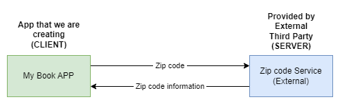
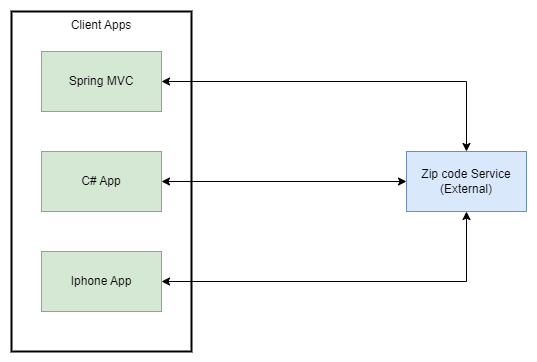

# Spring Framework overview, examples and commands <!-- omit in toc -->

## Contents <!-- omit in toc -->

- [1. What is Spring?](#1-what-is-spring)
  - [1.1. The Problem](#11-the-problem)
  - [1.2. Spring Boot Solution](#12-spring-boot-solution)
  - [1.3. Spring Boot and Spring](#13-spring-boot-and-spring)
  - [1.4. Spring Boot Embedded Server](#14-spring-boot-embedded-server)
  - [1.5. Running Spring Boot Apps](#15-running-spring-boot-apps)
  - [1.6. Deploying Spring Boot Apps](#16-deploying-spring-boot-apps)
  - [1.7. General questions](#17-general-questions)
- [2. Spring Initializr](#2-spring-initializr)
  - [2.1. start.spring.io](#21-startspringio)
  - [2.2. Spring Boot CLI](#22-spring-boot-cli)
- [3. REST Controller](#3-rest-controller)
- [4. Spring Projects](#4-spring-projects)
- [5. Spring Boot Projects](#5-spring-boot-projects)
  - [5.1. Maven Standard Directory Structure with Spring Boot](#51-maven-standard-directory-structure-with-spring-boot)
  - [5.2. Maven Wrapper files](#52-maven-wrapper-files)
  - [5.3. Maven POM file with Spring Boot](#53-maven-pom-file-with-spring-boot)
- [6. Spring Boot Starters](#6-spring-boot-starters)
- [7. Spring Boot Dev Tools](#7-spring-boot-dev-tools)
  - [7.1. IntelliJ Community Edition - DevTools](#71-intellij-community-edition---devtools)
- [8. Spring Boot Actuator](#8-spring-boot-actuator)
  - [8.1. Health Endpoint](#81-health-endpoint)
  - [8.2. Exposing Endpoints](#82-exposing-endpoints)
  - [8.3. Info Endpoint](#83-info-endpoint)
  - [8.4. Spring Boot Actuator Endpoints](#84-spring-boot-actuator-endpoints)
  - [8.5. Exposing Endpoints](#85-exposing-endpoints)
  - [8.6. Get A List of Beans](#86-get-a-list-of-beans)
  - [8.7. Development Process](#87-development-process)
  - [8.8. Security](#88-security)
    - [8.8.1. Secured Endpoints](#881-secured-endpoints)
  - [8.9. Excluding Endpoints](#89-excluding-endpoints)
    - [8.9.1. Development Process](#891-development-process)
  - [8.10. Actuator Example](#810-actuator-example)
- [9. Custom Application Properties](#9-custom-application-properties)
  - [9.1. Development Process](#91-development-process)
  - [9.2. Spring Boot Properties](#92-spring-boot-properties)
    - [9.2.1. Core Properties](#921-core-properties)
    - [9.2.2. Web Properties](#922-web-properties)
    - [9.2.3. Actuator Properties](#923-actuator-properties)
    - [9.2.4. Security Properties](#924-security-properties)
    - [9.2.5. Data Properties](#925-data-properties)
- [10. Inversion of Control and Dependency Injection](#10-inversion-of-control-and-dependency-injection)
  - [10.1. Injection Types](#101-injection-types)
    - [10.1.1. Injection Types - Which one to use?](#1011-injection-types---which-one-to-use)
    - [10.1.2. What is Spring AutoWiring](#1012-what-is-spring-autowiring)
  - [10.2. Autowiring Example](#102-autowiring-example)
  - [10.3. Example Application](#103-example-application)
  - [10.4. Development Process - Constructor Injection](#104-development-process---constructor-injection)
  - [10.5. Spring for Enterprise applications](#105-spring-for-enterprise-applications)
  - [10.6. Scanning for Component Classes](#106-scanning-for-component-classes)
  - [10.7. Annotations](#107-annotations)
  - [10.8. More on Component Scanning](#108-more-on-component-scanning)
  - [10.9. Setter Injection](#109-setter-injection)
  - [10.10. @Primary annotation](#1010-primary-annotation)
    - [10.10.1. Alternate solution](#10101-alternate-solution)
    - [10.10.2. @Primary - Only one](#10102-primary---only-one)
    - [10.10.3. Which one: @Primary or @Qualifier?](#10103-which-one-primary-or-qualifier)
  - [10.11. Lazy Initialization](#1011-lazy-initialization)
    - [10.11.1. Lazy Initialization](#10111-lazy-initialization)
    - [10.11.2. Advantages and Disadvantages](#10112-advantages-and-disadvantages)
  - [10.12. Bean Scopes](#1012-bean-scopes)
    - [10.12.1. Default Scope](#10121-default-scope)
  - [10.13. Additional Spring Bean Scopes](#1013-additional-spring-bean-scopes)
  - [10.14. Bean Lifecycle Methods - Annotations](#1014-bean-lifecycle-methods---annotations)
- [11. REST APIs - REST Web Services](#11-rest-apis---rest-web-services)
  - [11.1. Questions](#111-questions)
  - [11.2. Possible Solution](#112-possible-solution)
  - [11.3. Response - Zip Code](#113-response---zip-code)
  - [11.4. Multiple Client Apps](#114-multiple-client-apps)
  - [11.5. What do we call it?](#115-what-do-we-call-it)
- [12. JSON Basics - Syntax](#12-json-basics---syntax)
  - [12.1. Simple JSON Example](#121-simple-json-example)
  - [12.2. JSON Values](#122-json-values)
  - [12.3. Nested JSON Objects](#123-nested-json-objects)
  - [12.4. JSON Arrays](#124-json-arrays)
- [13. REST HTTP Basics](#13-rest-http-basics)
  - [13.1. HTTP Messages](#131-http-messages)
    - [13.1.1. HTTP Request Message](#1311-http-request-message)
    - [13.1.2. HTTP Response Message](#1312-http-response-message)
  - [13.2. HTTP Response - Status Codes](#132-http-response---status-codes)
  - [13.3. MIME Content Types](#133-mime-content-types)
  - [13.4. Client Tool](#134-client-tool)
    - [13.4.1. Web Browser vs Postman/Insomnia](#1341-web-browser-vs-postmaninsomnia)
- [14. Spring REST Controller](#14-spring-rest-controller)
  - [14.1. Add Maven Dependency](#141-add-maven-dependency)
  - [14.2. Java JSON Data Binding](#142-java-json-data-binding)
  - [14.3. Specialized Annotation for Services](#143-specialized-annotation-for-services)
- [15. Spring Data REST in Spring Boot](#15-spring-data-rest-in-spring-boot)
  - [15.1. HATEOAS](#151-hateoas)
  - [15.2. Spring Data REST Configuration, Pagination and Sorting](#152-spring-data-rest-configuration-pagination-and-sorting)
    - [15.2.1. REST Endpoints](#1521-rest-endpoints)
      - [15.2.1.1. Pluralized Form](#15211-pluralized-form)
      - [15.2.1.2. Problem](#15212-problem)
      - [15.2.1.3. Solution](#15213-solution)
    - [15.2.2. Pagination](#1522-pagination)
      - [15.2.2.1. Spring Data REST Configuration](#15221-spring-data-rest-configuration)
      - [15.2.2.2. Sample Configuration](#15222-sample-configuration)
    - [15.2.3. Sorting](#1523-sorting)
- [16. Spring Security](#16-spring-security)
  - [16.1. Servlet Filters](#161-servlet-filters)
  - [16.2. Security Concepts](#162-security-concepts)
  - [16.3. Declarative Security](#163-declarative-security)
  - [16.4. Programmatic Security](#164-programmatic-security)
  - [16.5. Enabling Spring Security](#165-enabling-spring-security)
  - [16.6. Authentication and Authorization](#166-authentication-and-authorization)
  - [16.7. Spring Security Password Storage](#167-spring-security-password-storage)
  - [16.8. Restrict Access Based on Roles](#168-restrict-access-based-on-roles)
  - [16.9. Cross-Site Request Forgery (CSRF)](#169-cross-site-request-forgery-csrf)
    - [16.9.1. When to use CSRF Protection?](#1691-when-to-use-csrf-protection)
  - [16.10. Database Access](#1610-database-access)
  - [16.11. Password Storage](#1611-password-storage)
    - [16.11.1. Password Storage - Best Practice](#16111-password-storage---best-practice)
  - [16.12. Spring Security Team Recommendation](#1612-spring-security-team-recommendation)
  - [16.13. How to Get a Bcrypt password](#1613-how-to-get-a-bcrypt-password)
  - [16.14. Spring Security Password Storage](#1614-spring-security-password-storage)
  - [16.15. Spring Security Login Process](#1615-spring-security-login-process)
  - [16.16. Matchers](#1616-matchers)
- [17. AOP](#17-aop)
- [18. JPA](#18-jpa)
- [19. Commands - Run from Command-Line](#19-commands---run-from-command-line)
  - [19.1. Maven Commands](#191-maven-commands)
  - [19.2. Spring commands](#192-spring-commands)
- [20. Points of attention](#20-points-of-attention)

# 1. What is Spring?

- Very popular framework for building Java applications.
- Provides a large number of helper classes and annotations.

## 1.1. The Problem

- Building a traditional Spring application is really HARD!!!
  - Q: Which JAR dependencies do I need?
  - Q: How do I set up configuration (xml or Java)?
  - Q: How do I install the server? (Tomcat, JBoss etc...)
- And that's JUST the basics for getting started.

## 1.2. Spring Boot Solution

- Make it easier to get started with Spring development.
- Minimize the amount of manual configuration.
  - Perform auto-configuration based on props files and JAR classpath.
- Help to resolve dependency conflicts (Maven or Gradle).
- Provide an embedded HTTP server so we can get started quickly.
- Tomcat, Jetty, Undertow, ...

## 1.3. Spring Boot and Spring

- Spring Boot uses Spring behind the scenes
- Spring Boot simply makes it easier to use Spring

## 1.4. Spring Boot Embedded Server

- No need to install a server separately.
- **Self-contained unit Nothing else to install!**

## 1.5. Running Spring Boot Apps

- Spring Boot apps can be run standalone (includes embedded server).
- Run the Spring Boot app from the IDE or command-line.
- `java -jar <name_jar_file>.jar`

## 1.6. Deploying Spring Boot Apps

- Spring Boot apps can also be deployed in the traditional way.
- Deploy Web Application Archive (WAR) file to an external server:
  - Tomcat, JBoss, WebSphere etc ...

## 1.7. General questions

- **Q: Does Spring Boot replace Spring MVC, Spring REST etc ...?**
  - No. Instead, Spring Boot actually uses those technologies.
    
- **Q: Does Spring Boot run code faster than regular Spring code?**
  - No.
  - Behind the scenes, Spring Boot uses same code of Spring Framework.
  - Remember, Spring Boot is about making it easier to get started.
  - Minimizing configuration etc ...
- **Q: Do I need a special IDE for Spring Boot?**
  - No.
  - We can use any IDE for Spring Boot apps ... even use plain text editor.
  - The Spring team provides free Spring Tool Suite (STS) [IDE plugins].
  - Some IDEs provide fancy Spring tooling support.
  - Not a requirement.

# 2. Spring Initializr

## 2.1. start.spring.io

- Quickly create a starter Spring Boot project.
- Select your dependencies.
- Creates a Maven/Gradle project.
- Import the project into your IDE.
- Eclipse, IntelliJ, NetBeans etc ...
- [start.spring.io](https://start.spring.io/)
  - If we are building a Spring app that needs: Web, Security, ...
  - Simply select the dependencies in the Spring Initializr.
  - It will add the appropriate Spring Boot starters to your `pom.xml`.

## 2.2. Spring Boot CLI

- Alternative to [start.spring.io](https://start.spring.io/).

# 3. REST Controller

- Basic structure:
  ```java
    @RestController
    public class HelloWorldController {
        @GetMapping("/")
        public String sayHello() {
            return "Hello World!";
        }
    }
  ```
- [Example](/Examples/first-rest-controller/)

# 4. Spring Projects

- Additional Spring modules built-on top of the core Spring Framework
  - Only use what we need ...
  - Spring Cloud, Spring Data.
  - Spring Batch, Spring Security.
  - Spring Web Services, Spring LDAP.
  - others ...

# 5. Spring Boot Projects

## 5.1. Maven Standard Directory Structure with Spring Boot


## 5.2. Maven Wrapper files

- `mvnw` allows we to run a Maven project.
  - No need to have Maven installed or present on your path.
  - If correct version of Maven is **NOT** found on your computer.
    - **Automatically downloads** correct version and runs Maven.
- Two files are provided:
  - `mvnw.cmd` for MS Windows.
    - `mvnw clean compile test`
  - `mvnw.sh` for Linux/Mac.
    - `./mvnw clean compile test`
- If we already have Maven installed previously.
  - Then we can ignore/delete the `mvnw` files.
    
- Just use Maven as you normally would.
  - `mvn clean compile test`

## 5.3. Maven POM file with Spring Boot

- pom.xml includes info that you entered at Spring Initializr website.
  ```xml
    <groupId>com.starterspringbootproject</groupId>
    <artifactId>starter-spring-boot-project</artifactId>
    <version>0.0.1-SNAPSHOT</version>
  ```
- Spring Boot Starters, a collection of Maven dependencies (Compatible versions).

  ```xml
    <dependencies>
      ...
      <dependency>
        <groupId>org.springframework.boot</groupId>
        <artifactId>spring-boot-starter</artifactId>
      </dependency>

      <dependency>
        <groupId>org.springframework.boot</groupId>
        <artifactId>spring-boot-starter-test</artifactId>
        <scope>test</scope>
      </dependency>
      ...
    </dependencies>
  ```

- To package executable `jar` or `war` archive, can also easily run the app.
  ```xml
    <build>
      <plugins>
        <plugin>
          <groupId>org.springframework.boot</groupId>
          <artifactId>spring-boot-maven-plugin</artifactId>
        </plugin>
      </plugins>
    </build>
  ```

# 6. Spring Boot Starters

- **The Problem...**
  - Building a Spring application is really HARD!!!
- **Why Is It So Hard?**
  - It would be great if there was a simple list of Maven dependencies.
  - Collected as a group of dependencies ... one-stop shop.
  - So I don't have to search for each dependency.
- **Spring Boot Starters**
  - A curated list of Maven dependencies.
  - A collection of dependencies grouped together.
  - Tested and verified by the Spring Development team.
  - Makes it much easier for the developer to get started with Spring.
  - Reduces the amount of Maven configuration.
- There are 30+ Spring Boot Starters from the Spring Development team.
  | Name | Description |
  | ---------------------------- | ------------------------------------------------------------------------------------- |
  | spring-boot-starter-web | Building web apps, includes validation, REST. Uses Tomcat as default embedded server. |
  | spring-boot-starter-security | Adding Spring Security support. |
  | spring-boot-starter-data-jpa | Spring database support with JPA and Hibernate. |
  | ... | |
- [Full list](https://github.com/spring-projects/spring-boot/tree/main/spring-boot-project/spring-boot-starters)

# 7. Spring Boot Dev Tools

- **The Problem...**
  - When running Spring Boot applications.
    - If you make changes to your source code.
    - Then we have to manually restart your application.
- **Solution:** Spring Boot Dev Tools.
  - `spring-boot-devtools` to the rescue!
  - Automatically restarts your application when code is updated.
  - Simply add the dependency to your POM file.
  - No need to write additional code :-).
  - For IntelliJ, need to set additional configurations...
- Adding the dependency to your POM file:
  ```xml
    <dependency>
      <groupId>org.springframework.boot</groupId>
      <artifactId>spring-boot-devtools</artifactId>
      <scope>runtime</scope>
      <optional>true</optional>
    </dependency>
  ```
- Automatically restarts your application when code is updated.

## 7.1. IntelliJ Community Edition - DevTools

1. IntelliJ Community Edition doesn't support DevTools by default.

- **Select:** File > Settings > Build, Execution, Deployment > Compiler.
  - **Check box:** Build project automatically.
- **Select:** File > Settings > Advanced Settings.
- Check box: Allow auto-make to ...

2. Apply IntelliJ configurations.
3. Edit `pom.xml` and add spring-boot-devtools.
4. Add new REST endpoint to our app.
5. Verify the app is automatically reloaded.

# 8. Spring Boot Actuator

- **Problem...**
  - How can we monitor and manage my application?
  - How can we check the application health?
  - How can we access application metrics?
- **Solution: Spring Boot Actuator**
  - Exposes endpoints to monitor and manage your application.
  - We easily get DevOps functionality out-of-the-box.
  - Simply add the dependency to your POM file.
  - REST endpoints are **automatically** added to your application.
  - No need to write additional code!
  - We get new REST endpoints for FREE!
  - Adding the dependency to your POM file:
    ```xml
      <dependency>
      <groupId>org.springframework.boot</groupId>
      <artifactId>spring-boot-starter-actuator</artifactId>
    </dependency>
    ```
- Automatically exposes endpoints for metrics out-of-the-box.
- Endpoints are prefixed with: `/actuator`.

## 8.1. Health Endpoint

- `/health` checks the status of your application.
- Normally used by monitoring apps to see if your app is up or down.
  - Health status is customizable based on your own business logic.

## 8.2. Exposing Endpoints

- By default, only `/health` is exposed.
- The `/info` endpoint can provide information about your application.
- To expose `/info`.
- File: `src/main/resources/application.properties`.
  ```
    management.endpoints.web.exposure.include=health,info
    management.info.env.enabled=true
  ```

## 8.3. Info Endpoint

- `/info` gives information about your application.
  - Default is empty.
- Update `application.properties` with your app info.
- File: `src/main/resources/application.properties`
  ```
    info.app.name=Actuator Project
    info.app.description=An example project using Spring Boot Actuator.
    info.app.version=1.0.0
  ```

## 8.4. Spring Boot Actuator Endpoints

- There are 10+ Spring Boot Actuator endpoints:
  | Name | Description |
  | ------------ | -------------------------------------------------------------- |
  | /auditevents | Audit events for your application |
  | /beans | List of all beans registered in the Spring application context |
  | /mappings | List of all @RequestMapping paths |
  | ... | ... |

## 8.5. Exposing Endpoints

- By default, only `/health` is exposed.
- To expose all actuator endpoints over HTTP.
- File: `src/main/resources/application.properties`
  ```
    # Use wildcard "*" to expose all endpoints
    # Can also expose individual endpoints with a comma-delimited list
    #
    management.endpoints.web.exposure.include=*
  ```

## 8.6. Get A List of Beans

- Access http://localhost:8080/actuator/beans

## 8.7. Development Process

1. Edit `pom.xml` and add `spring-boot-starter-acuator`.
2. View actuator endpoints for: `/health`.
   - `http://localhost:8080/actuator/health`
3. Edit `application.properties` to customize `/info`.

## 8.8. Security

- **What about Security?**
  - We may **NOT** want to expose all of this information.
- **Solution**
  - Add Spring Security to project and endpoints are secured.
  ```xml
    <dependency>
      <groupId>org.springframework.boot</groupId>
      <artifactId>spring-boot-starter-security</artifactId>
    </dependency>
  ```

### 8.8.1. Secured Endpoints

- Now when we access: `/actuator/beans`.
  - Spring Security will prompt for login.
  - Default user name: **user**.
  - Check console logs for password.
- We can override default user name and generated password.
- File: `src/main/resources/application.properties`
  ```
    spring.security.user.name=jefte
    spring.security.user.password=euamojesus
  ```
- We can customize Spring Security for Spring Boot Actuator.
- Use a database for roles, encrypted passwords etc...

## 8.9. Excluding Endpoints

- To exclude `/health`
- File: `src/main/resources/application.properties`
- `management.endpoints.web.exposure.exclude=health`

### 8.9.1. Development Process

1. Edit `pom.xml` and add `spring-boot-starter-security`.
2. Verify security on actuator endpoints for: `/beans` etc.
3. Disable endpoints for `/health` and `/info`.

## 8.10. Actuator Example

[Actuator Example](/Examples/actuator-project/)

# 9. Custom Application Properties

- **Problem**
  - You need for your app to be configurable ... no hard-coding of values.
  - You need to read app configuration from a properties file.
- **Solution:**
  - Application Properties file.
  - By default, Spring Boot reads information from a standard properties file.
    - Located at: `src/main/resources/application.properties`
      - Standard Spring Boot file name.
- You can define ANY custom properties in this file.
- Your Spring Boot app can access properties using `@Value`.
  - No additional coding or configuration required.

## 9.1. Development Process

1. Define custom properties in `application.properties`.
   1. File: `src/main/resources/application.properties`.
   2. ```
        books.name=Bible
        authors.name=God
      ```
2. Inject properties into Spring Boot application using `@Value`.

```java
  @RestController
  public class MyRestController {
      @Value("${books.name}")
      private String book;

      @Value("${authors.name}")
      private String author;

      @GetMapping("/")
      public String GetBook() {
          return "Book: " + book + " By " + author;
      }
  }
```

## 9.2. Spring Boot Properties

- Spring Boot can be configured in the `application.properties` file.
- Server port, context path, actuator, security etc ...
- Spring Boot has 1,000+ properties.
- The properties are roughly grouped into the following categories:
  - Core
  - Web
  - Security
  - Actuator
  - Integration
  - DevTools
  - Data
  - Testing

### 9.2.1. Core Properties

```
  # Log levels severity mapping
  logging.level.org.springframework=DEBUG
  logging.level.org.hibernate=TRACE
  logging.level.com.myfirstapp=INFO

  # Log file name
  logging.file.name=my-crazy-stuff.log
  logging.file.path=c:/myapps/demo
```

### 9.2.2. Web Properties

```
  # HTTP server port
  server.port=7070
  # Context path of the application
  server.servlet.context-path=/my-first-app
  # Default HTTP session time out
  server.servlet.session.timeout=15m
```

### 9.2.3. Actuator Properties

```
  # Endpoints to include by name or wildcard
  management.endpoints.web.exposure.include=*
  # Endpoints to exclude by name or wildcard
  management.endpoints.web.exposure.exclude=beans,mapping
  # Base path for actuator endpoints
  management.endpoints.web.base-path=/actuator
```

### 9.2.4. Security Properties

```
  # Default user name
  spring.security.user.name=admin

  # Password for default user
  spring.security.user.password=admin@123
```

### 9.2.5. Data Properties

```
  # JDBC URL of the database
  spring.datasource.url=jdbc:mysql://localhost:3306/ecommerce

  # Login username of the database
  spring.datasource.username=admin

  # Login password of the database
  spring.datasource.password=admin@123
```

# 10. Inversion of Control and Dependency Injection

[IoC and Dependency Injection](https://github.com/jeftegoes/IoCAndDependencyInjectionOverviewWithExamples)

## 10.1. Injection Types

- There are multiple types of injection with Spring.
- **We will cover the two recommended types of injection**
  - Constructor Injection
  - Setter Injection

### 10.1.1. Injection Types - Which one to use?

- **Constructor Injection**
  - Use this when you have required dependencies.
  - Generally recommended by the spring.io development team as first choice.
- **Setter Injection**
  - Use this when you have optional dependencies.
  - If dependency is not provided, your app can provide reasonable default logic.
- **Field Injection**
  - Not recommended by the spring.io development team.
  - In the early days, field injection was popular on Spring projects.
    - In recent years, it has fallen out of favor.
  - In general, it makes the code harder to unit test.
  - As a result, the spring.io team doesn't recommend field injection.
    - However, you will still see it being used on legacy projects.

### 10.1.2. What is Spring AutoWiring

- For dependency injection, Spring can use `autowiring`.
- Spring will look for a class that matches.
  - _matches by type: class or interface._
- Spring will inject it automatically ... hence it is `autowired`.

## 10.2. Autowiring Example

- Injecting a `Payment` implementation.
- Spring will scan for `@Components`.
- Any one implements the `Payment` interface???
- If so, let's inject them. For example: `PixPayment`.

## 10.3. Example Application


## 10.4. Development Process - Constructor Injection

1. Define the dependency interface and class.
2. Create Demo REST Controller.
3. Create a constructor in your class for injections.
4. Add `@GetMapping` for `/discount`.

## 10.5. Spring for Enterprise applications

- Spring is targeted for enterprise, real-time / real-world applications.
- Spring provides features such as:
  - Database access and Transactions.
  - REST APIs and Web MVC.
  - Security.
  - etc ...

## 10.6. Scanning for Component Classes

- Spring will scan your Java classes for special annotations.
  - `@Component`, etc ...
- Automatically register the beans in the Spring container.

## 10.7. Annotations

- `@SpringBootApplication` is composed of the following annotations:
  | Annotation | Description |
  | ------------------------ | ---------------------------------------------------------------------------------- |
  | @EnableAutoConfiguration | Enables Spring Boot's auto-configuration support. |
  | @ComponentScan | Enables component scanning of current package also recursively scans sub-packages. |
  | @Configuration | Able to register extra beans with or import other configuration classes. |

## 10.8. More on Component Scanning

- By default, Spring Boot starts component scanning.
  - From same package as your main Spring Boot application.
  - Also scans sub-packages recursively.
- This implicitly defines a base search package
  - Allows you to leverage default component scanning.
  - No need to explicitly reference the base package name.

## 10.9. Setter Injection

- Constructor Injection.
- Setter Injection.
- **Inject dependencies by calling setter method(s) on your class**.
- Injecting a Payment implementation.
- Spring will scan `@Components`
- Any one implements Payment interface???
- If so, let's inject them ... oops which one?

## 10.10. @Primary annotation

- Resolving issue with Multiple Payment implementations.
  - In the case of multiple Payment implementations.
    - We resolved it using `@Qualifier`
    - We specified a payment by name.
  - Alternate solution available...

### 10.10.1. Alternate solution

- Instead of specifying a payment by name using `@Qualifier`
- I simply need a payment ... I don't care which payment
- If there are multiple payments
- Then we payments figure it out ... and tell me who's the `primary` payment

### 10.10.2. @Primary - Only one

- When using `@Primary`, can have only one for multiple implementations.
- If you mark multiple classes with @Primary ... umm, we have a problem.
- Mixing @Primary and @Qualifier
- If we mix `@Primary` and `@Qualifier`
  - `@Qualifier` has higher priority

### 10.10.3. Which one: @Primary or @Qualifier?

- `@Primary` leaves it up to the implementation classes.
  - Could have the issue of multiple `@Primary` classes leading to an error.
- `@Qualifier` allows to you be very specific on which bean you want.
- In general, I recommend using `@Qualifier`
  - More specific.
  - Higher priority.

## 10.11. Lazy Initialization

- By default, when your application starts, all beans are initialized.
  - `@Component`, etc ...
- Spring will create an instance of each and make them available.

### 10.11.1. Lazy Initialization

- Instead of creating all beans up front, we can specify lazy initialization
- A bean will only be initialized in the following cases:
  - It is needed for dependency injection
  - Or it is explicitly requested
- Add the `@Lazy` annotation to a given class
- To configure other beans for lazy initialization.
- We would need to add `@Lazy` to each class.
- Turns into tedious work for a large number of classes.
- I wish we could set a global configuration property ...

### 10.11.2. Advantages and Disadvantages

- **Advantages**
  - Only create objects as needed.
  - May help with faster startup time if you have large number of components.
- **Disadvantages**
  - May not discover configuration issues until too late.
  - If you have web related components like `@RestController`, not created until requested.
  - Need to make sure you have enough memory for all beans once created.
- **Lazy initialization feature is disabled by default.**
- **You should profile your application before configuring lazy initialization.**
- **Avoid the common pitfall of premature optimization.**

## 10.12. Bean Scopes

- Scope refers to the lifecycle of a bean.
- How long does the bean live?
- How many instances are created?
- How is the bean shared?

### 10.12.1. Default Scope

- Default scope is singleton
  - Refresher: What's a Singleton?
- Spring Container creates only one instance of the bean, by default.
- It is cached in memory.
- All dependency injections for the bean.
  - will reference the SAME bean.

## 10.13. Additional Spring Bean Scopes

| Scope       | Description                                                 |
| ----------- | ----------------------------------------------------------- |
| singleton   | Create a single shared instance of the bean. Default scope. |
| prototype   | Creates a new bean instance for each container request.     |
| request     | Scoped to an HTTP web request. Only used for web apps.      |
| session     | Scoped to an HTTP web session. Only used for web apps.      |
| application | Scoped to a web app ServletContext. Only used for web apps. |
| websocket   | Scoped to a web socket. Only used for web apps.             |

## 10.14. Bean Lifecycle Methods - Annotations

- We could use the Amazon S3 Client in our Spring application
- The Amazon S3 Client class was not originally annotated with @Component
- However, we configured the S3 Client as a Spring Bean using @Bean
- It is now a Spring Bean and we can inject it into other services of our application
- Make an existing third-party class available to Spring framework

# 11. REST APIs - REST Web Services

- Build a client app that provides the **zip code** informations.
- Need to get **zipc ode** data from an external service.
  

## 11.1. Questions

- **How will we connect to the Zip Code Service?**
  - We can make [REST API](https://restfulapi.net/) calls over HTTP.
  - REST: REpresentational State Transfer.
  - Lightweight approach for communicating between applications.
- **What programming language do we use?**
  - REST is language independent.
  - The **client** application can use **ANY** programming language.
  - The **server** application can use **ANY** programming language.
- **What is the data format?**
  - REST applications can use any data format.
  - Commonly see XML and JSON.
  - JSON is most popular and modern.
  - JavaScript Object Notation.

## 11.2. Possible Solution

- Use online zip code API provided by: [ViaCEP](https://viacep.com.br/)
- Provide zip code data via an API.
- Data is available in multiple formats: JSON, XML etc ...
- The API documentation gives us the following:
  - `https://viacep.com.br/ws/{zipcode}/json/`.
  - Pass the **zip code** of the city.

## 11.3. Response - Zip Code

- The Zip Code Service responds with JSON:
  ```json
  {
    "cep": "01001-000",
    "logradouro": "Praça da Sé",
    "complemento": "lado ímpar",
    "unidade": "",
    "bairro": "Sé",
    "localidade": "São Paulo",
    "uf": "SP",
    "estado": "São Paulo",
    "regiao": "Sudeste",
    "ibge": "3550308",
    "gia": "1004",
    "ddd": "11",
    "siafi": "7107"
  }
  ```

## 11.4. Multiple Client Apps

- Remember:
  - REST calls can be made over HTTP.
  - REST is language independent.
    

## 11.5. What do we call it?

- REST API
- REST Web Services
- RESTful API
- RESTful Web Services
- REST Services
- RESTful Services
- **Generally, all mean the SAME thing.**
- [restfulapi](https://restfulapi.net/)

# 12. JSON Basics - Syntax

- What is JSON?
  - **J**ava**S**cript **O**bject **N**otation
- Lightweight data format for storing and exchanging data... plain text.
- Language independent ... not just for **JavaScript**.
- Can use with any programming language: **Java**, **C#**, **Python** etc...

## 12.1. Simple JSON Example

- Curley braces define objects in JSON.
- Object members are name / value pairs.
  - Delimited by colons.
- Name is **always** in double-quotes.
  ```json
  {
    "id": 14,
    "firstName": "Jefté",
    "lastName": "Goes",
    "active": true
  }
  ```
- `"name": value`

## 12.2. JSON Values

- `Numbers`: no quotes.
- `String`: in double quotes.
- `Boolean`: `true`, `false`
- Nested JSON object.
- `Array`
- `null`

## 12.3. Nested JSON Objects

```json
{
  "id": 14,
  "firstName": "Jefté",
  "lastName": "Goes",
  "active": true,
  "address": {
    "street": "Rua 7",
    "city": "Salvador",
    "state": "BA",
    "zip": "4400000",
    "country": "Brazil"
  }
}
```

## 12.4. JSON Arrays

```json
{
  "id": 14,
  "firstName": "Jefté",
  "lastName": "Goes",
  "active": true,
  "languages": ["Java", "C#", "Python", "Javascript"]
}
```

# 13. REST HTTP Basics

- Most common use of REST is over HTTP.
- Leverage HTTP methods for CRUD operations.

| HTTP Method | CRUD Operation                           |
| ----------- | ---------------------------------------- |
| POST        | Create a new entity                      |
| GET         | Read a list of entities or single entity |
| PUT         | Update an existing entity                |
| DELETE      | Delete an existing entity                |

## 13.1. HTTP Messages

Client
My  
CRM  
App
HTTP Request
Message
HTTP Response
Message
Server
CRM  
REST
Service

### 13.1.1. HTTP Request Message

- Request line: the HTTP command.
- Header variables: request metadata.
- Message body: contents of message.
  

### 13.1.2. HTTP Response Message

- Response line: server protocol and status code.
- Header variables: response metadata.
- Message body: contents of message.
  

## 13.2. HTTP Response - Status Codes

| Code Range | Description   |
| ---------- | ------------- |
| 100 - 199  | Informational |
| 200 - 299  | Successful    |
| 300 - 399  | Redirection   |
| 400 - 499  | Client error  |
| 500 - 599  | Server error  |

## 13.3. MIME Content Types

- The message format is described by MIME content type.
  - Multipurpose Internet Mail-Extension.
- Basic Syntax: `type/sub-type`.
- Examples
  - `text/html`, `text/plain`
  - `application/json`, `application/xml`, ...

## 13.4. Client Tool

- Send HTTP requests to the REST Web Service / API.
- Plenty of tools available: curl, Postman, Insomnia, etc ...

### 13.4.1. Web Browser vs Postman/Insomnia

- For simple REST testing for GET requests.
- Web Browser and Postman/Insomnia are similar.
- However, for advanced REST testing: POST, PUT etc ...
- Postman/Insomnia has much better support.
- POSTing JSON data, setting content type.
- Passing HTTP request headers, authentication etc ...

# 14. Spring REST Controller

- Adds REST support.
  ```java
    @RestController
    @RequestMapping("/test")
    public class DemoRestController {
      @GetMapping("/hello")
      public String sayHello() {
        return "Hello World!";
      }
    }
  ```
- Access the REST endpoint at `/test/hello`.
- `Returns content to client`.

## 14.1. Add Maven Dependency

- File: `pom.xml`
- Add Spring Boot Starter Web.
  ```
    <dependency>
      <groupId>org.springframework.boot</groupId>
      <artifactId>spring-boot-starter-web</artifactId>
    </dependency>
  ```

## 14.2. Java JSON Data Binding

- Data binding is the process of converting JSON data to a Java POJO.
- Spring uses the [Jackson Project](https://github.com/FasterXML/jackson-databind) behind the scenes.
- Jackson handles data binding between JSON and Java POJO.

## 14.3. Specialized Annotation for Services

- Spring provides the `@Service` annotation.
- `@Service` applied to Service implementations.
- Spring will automatically register the Service implementation `component-scanning`.

# 15. Spring Data REST in Spring Boot

- For Spring Data REST, you only need 3 items.

1. Your entity: Book
2. `JpaRepository`: BookRepository extends `JpaRepository`
3. Maven POM dependency for: `spring-boot-starter-data-rest`

```
  <dependency>
    <groupId>org.springframework.boot</groupId>
    <artifactId>spring-boot-starter-data-rest</artifactId>
  </dependency>
```

- Absolutely NO CODING required.
- Spring Data REST will scan for `JpaRepository`.

## 15.1. HATEOAS

- For details on [HATEOAS](https://spring.io/projects/spring-hateoas).
- HATEOAS uses Hypertext Application Language (HAL) data format.
  - For details on [HAL](https://en.wikipedia.org/wiki/Hypertext_Application_Language).

## 15.2. Spring Data REST Configuration, Pagination and Sorting

- [Spring Data REST](https://spring.io/projects/spring-data-rest)

### 15.2.1. REST Endpoints

- By default, Spring Data REST will create endpoints based on entity type.
- **Simple** pluralized form.
  - First character of Entity type is lowercase.
  - Then just adds an "s" to the entity.
- `public interface BookRepository extends JpaRepository<Book, Integer> {}` -> `/books`

#### 15.2.1.1. Pluralized Form

- Spring Data REST pluralized form is VERY simple.
- Just adds an **s** to the entity.
- The English language is VERY complex!
- Spring Data REST doesn't handle:
  | Singular | Plural |
  | -------- | ------- |
  | Goose | Geese |
  | Person | People |
  | Syllabus | Syllabi |
  | ... | ... |

#### 15.2.1.2. Problem

- Spring Data REST doesn't handle complex pluralized forms.
- In this case, you need to specify plural name.
- What if we want to expose a different resource name?
  - Instead of `/books` ... use `/members`.

#### 15.2.1.3. Solution

- Specify plural name / path with an annotation:
  ```java
    @RepositoryRestResource(path="members")
    public interface BookRepository extends JpaRepository<Book, Integer> {
    }
  ```
- `http://localhost:8080/members`

### 15.2.2. Pagination

- By default, Spring Data REST will return the first 20 elements.
  - Page size = 20
- We can navigate to the different pages of data using query param:
  - ttp://localhost:8080/books?page=0
  - http://localhost:8080/books?page=1
  - ...
- **Pages are zero-based**

#### 15.2.2.1. Spring Data REST Configuration

- Following properties available: `application.properties`

| Name                               | Description                                   |
| ---------------------------------- | --------------------------------------------- |
| spring.data.rest.base-path         | Base path used to expose repository resources |
| spring.data.rest.default-page-size | Default size of pages                         |
| spring.data.rest.max-page-size     | Maximum size of pages                         |
| ...                                | ...                                           |

#### 15.2.2.2. Sample Configuration

- File: `application.properties`
  ```
    spring.data.rest.base-path=/api # http://localhost:8080/api/books
    spring.data.rest.default-page-size=50  # Returns 50 elements per page
  ```

### 15.2.3. Sorting

- We can sort by the property names of your entity.
- Sort by last name (ascending is default)
  - `http://localhost:8080/books?sort=lastName`
- Sort by first name, descending
  - `http://localhost:8080/books?sort=firstName,desc`
- Sort by last name, then first name, ascending
  - `http://localhost:8080/books?sort=lastName,firstName,asc`

# 16. Spring Security

- **Spring Security Model**
  - Spring Security defines a framework for security.
  - Implemented using Servlet filters in the background.
  - Two methods of securing an app: declarative and programmatic.

## 16.1. Servlet Filters

- Servlet Filters are used to pre-process / post-process web requests.
- Servlet Filters can route web requests based on security logic.
- Spring provides a bulk of security functionality with servlet filters.
  - **Spring Security Overview**
    
  - **Spring Security Workflow**
    

## 16.2. Security Concepts

- **Authentication**
  - Check user id and password with credentials stored in app / db.
- **Authorization**
  - Check to see if user has an authorized role.

## 16.3. Declarative Security

- Define application's security constraints in configuration.
  - All Java config: `@Configuration`.
- Provides separation of concerns (SoC) between application code and security.

## 16.4. Programmatic Security

- Spring Security provides an API for custom application coding.
- Provides greater customization for specific app requirements.

## 16.5. Enabling Spring Security

1. Edit `pom.xml` and add `spring-boot-starter-security`.

```xml
  <dependency>
    <groupId>org.springframework.boot</groupId>
    <artifactId>spring-boot-starter-security</artifactId>
  </dependency>
```

2. This will automagically secure **all endpoints** for application.

   - Now when we access our application.
   - Spring Security will prompt for login.
   - **Default user name:** user
   - Check console logs for password.

3. We can override default user name and generated password.

- File: `src/main/resources/application.properties`

```
  spring.security.user.name=jefte
  spring.security.user.password=master@123
```

## 16.6. Authentication and Authorization

- In-memory.
- JDBC.
- LDAP.
- Custom / Pluggable.
- Others...

## 16.7. Spring Security Password Storage

- In Spring Security, passwords are stored using a specific format: `{id}encodedPassword`

| ID     | Description             |
| ------ | ----------------------- |
| noop   | Plain text passwords    |
| bcrypt | BCrypt password hashing |
| ...    | ...                     |

- **Password Example**
  

## 16.8. Restrict Access Based on Roles

```sql
  INSERT INTO `authorities`
  VALUES
  ('brenno', 'ROLE_TEACHER'),
  ('barbara', 'ROLE_TEACHER'),
  ('barbara', 'ROLE_COORDINATOR'),
  ('jefte', 'ROLE_TEACHER'),
  ('jefte', 'ROLE_COORDINATOR'),
  ('jefte', 'ROLE_ADMIN');
```

## 16.9. Cross-Site Request Forgery (CSRF)

- Spring Security can protect against **CSRF** attacks.
- Embed additional authentication data/token into all HTML forms.
- On subsequent requests, web app will verify token before processing.
- Primary use case is traditional web applications (HTML forms etc ...).
  

### 16.9.1. When to use CSRF Protection?

- The Spring Security team recommends.
  - Use **CSRF** protection for any normal browser web requests.
  - Traditional web apps with HTML forms to add/modify data.
- If we are building a REST API for non-browser clients.
  - We may want to disable **CSRF** protection.
- In general, not required for stateless REST APIs.
  - That use POST, PUT, DELETE and/or PATCH.
- **Example**
  ```java
    http.csrf(csrf -> csrf.disable());
  ```
- In general, **CSRF** is not required for **stateless REST APIs** that use POST, PUT, DELETE and/or PATCH.

## 16.10. Database Access

- Spring Security can read user account info from database.
- By default, you have to follow Spring Security's predefined table schemas.
- Can also customize the table schemas.
  
- Useful if you have custom tables specific to your project / custom.
- We will be responsible for developing the code to access the data.
  - JDBC, JPA/Hibernate etc ...

## 16.11. Password Storage

- So far, our user passwords are stored in plaintext.
  - But not for production / real-time project.
  ```sql
    INSERT INTO `users`
    VALUES
    ('brenno', '{noop}master@123', 1),
    ('barbara', '{noop}master@123', 1),
    ('jefte', '{noop}master@123', 1);
  ```

### 16.11.1. Password Storage - Best Practice

- The best practice is store passwords in an encrypted format.
  ```sql
    INSERT INTO `users`
    VALUES
    ('brenno', '{bcrypt}$2a$10$a2eZLPE1rSQ7ZIqnD2IxPOoBedWMBgNpU.s14k7IPq6EsDixn/5SC', 1),
    ('barbara', '{bcrypt}$2a$10$KQsIaTz9PeTB9kb3S05dhec6qhsCFjjIU/0kecWapur5V3B98vNDy', 1),
    ('jefte', '{bcrypt}$2a$10$pexiL67R6kwy/rHOSClyZO3ZIh/uPuDoFd3EQB0WS42l1q2BDOTVm', 1);
  ```

## 16.12. Spring Security Team Recommendation

- Spring Security recommends using the popular **bcrypt** algorithm.
- **bcrypt**
  - Performs one-way encrypted hashing.
  - Adds a random salt to the password for additional protection.
  - Includes support to defeat brute force attacks.

## 16.13. How to Get a Bcrypt password

- We have a plaintext password and you want to encrypt using bcrypt.
  - Option 1: Use a website utility to perform the encryption.
    - [Visit: /generate-bcrypt-password](https://bcrypt-generator.com/)
  - Option 2: Write Java code to perform the encryption.

## 16.14. Spring Security Password Storage

- In Spring Security, passwords are stored using a specific format: `{bcrypt}encodedPassword`
- **Password column must be at least 68 chars wide**
  - `{bcrypt}` - 8 chars
  - encodedPassword - 60 chars

## 16.15. Spring Security Login Process

1. Retrieve password from db for the user.
2. Read the encoding algorithm id (bcrypt etc).
3. For case of bcrypt, encrypt plaintext password from login form (using salt from db password).
4. Compare encrypted password from login form WITH encrypted password from db.
5. If there is a match, login successful.
6. If no match, login NOT successful.

- **Note: The password from db is NEVER decrypted Because bcrypt is a one-way encryption algorithm.**


## 16.16. Matchers

- `requestMatchers("/**")`
  - The `/**` pattern matches all routes, allowing unrestricted access.

# 17. AOP

# 18. JPA

[JPA Overview and Examples](https://github.com/jeftegoes/JavaJPAOverviewAndExamples)

# 19. Commands - Run from Command-Line

- During development we spend most of our time in the IDE.
- However, we may want to run our Spring Boot app outside of the IDE.
- One approach is running from the command-line.
- When running from the command-line.
- No need to have IDE open/running.
- Since we using Spring Boot, the server is embedded in our JAR file.
- No need to have separate server installed/running .
- Spring Boot apps are **self-contained**.
- Two options for running the app
- Option 1: Use `java -jar <my_jar_file.jar>`
- Option 2: Use Spring Boot Maven plugin
  - `mvnw spring-boot:run`

## 19.1. Maven Commands

- **Run from command prompt!**
- Create new Maven project
  - `mvn archetype:generate -DgroupId=com.packagename -DartifactId=ClassName -DarchetypeArtifactId=maven-archetype-quickstart -DinteractiveMode=false`
- Rum Spring Boot project
  - `mvn spring-boot:run`
- Test...
  - `mvn clean install -U`

## 19.2. Spring commands

- List of possibilities
  - `spring init --list`
- Create new Maven project with Spring Boot
  - `spring init --type=maven-project --javaVersion=22 --artifactId=starter-spring-boot-project --groupId=com.starterpringbootproject`
  - `spring init --type=maven-project --javaVersion=22 --artifactId=starter-rest-controller --groupId=com.starterrestcontroller --dependencies=web,devtools,actuator,security`
    - spring-boot-devtools
    - spring-boot-starter-web
    - spring-boot-starter-security
    - spring-boot-starter-actuator

# 20. Points of attention

- To use `ObjectMapper (com.fasterxml.jackson.core)` class without `@Bean` is necessary:
  ```xml
    <dependency>
        <groupId>org.springframework.boot</groupId>
        <artifactId>spring-boot-starter-web</artifactId>
    </dependency>
  ```
- **Otherwise... compilation error**
  - Parameter 1 of constructor in com.example.SecretsManagerApplication required a bean of type 'com.fasterxml.jackson.databind.ObjectMapper' that could not be found.
